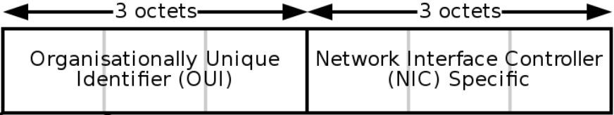
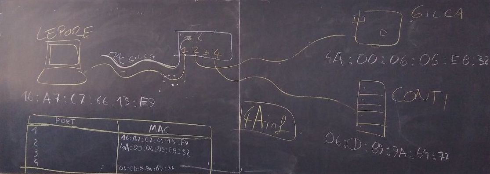

# Data-link layer

Cominciamo le lezioni di quest'anno con un approfondimento sul livello 2 della pila ISO-OSI: il _data-link layer_.

Come dice il nome, il livello data-link ci assicura che ci sia un collegamento (_link_) che permetta di scambiare dati tra più computer. Il suo funzionamento quindi prevederà il minimo necessario per far sì che questo avvenga.

## MAC Address
Per cominciare, ci dovrà essere un modo per distinguere le diverse macchine tra di loro. Come facciamo a dire che il destinatario del mio messaggio deve essere un esatto computer, e che il mittente sono proprio io? Per fare questo, il livello 2 data-link utilizza il concetto di _indirizzo MAC_ (in inglese MAC address).

> MAC è l'acronimo di Media Access Control.

Possiamo pensare al MAC come il codice fiscale della nostra interfaccia di rete, che è univoco in tutto il mondo. In altre parole, non possono esistere due interfacce di rete con lo stesso indirizzo MAC. È composto da 6 byte (48 bit), che convenzionalmente sono divisi tra loro da `:` (due punti). Un MAC address valido è, ad esempio, `01:02:03:ab:cd:ef`.

>  Secondo lo standard più diffuso attualmente, i primi 3 byte del MAC identificano la casa produttrice e gli ultimi 3 l'interfaccia.

> Potreste trovare anche altri separatori tra i byte del MAC address, come ad esempio il punto o il trattino. Sono meno comuni e ne sconsiglio l'uso.

Sottolineo che abbiamo detto che il MAC address è assegnato ad ogni singola _interfaccia di rete_ e non al computer nel suo complesso. Questo perché, molto spesso, un computer ha più di una interfaccia di rete. Ad esempio uno smartphone ha l'interfaccia per la rete dati in 4G ed un'altra interfaccia per il WiFi. Ovviamente, le due interfacce avranno MAC address diversi.

## Switch
Immaginiamo ora di dover connettere tre computer tra di loro. Connettiamo con un cavo Ethernet la loro interfaccia LAN ad uno switch, che ricordiamo essere un dispositivo di rete con tante _porte_ a cui si possono collegare altrettante macchine. Lo switch, avrà quindi il compito di smistare i pacchetti al giusto destinatario.

Domanda: perché lo switch deve preoccuparsi di smistare il pacchetto solo al destinatario, e non inoltra tutto a tutti? Identifichiamo due problemi principali.
- sicurezza: non vogliamo che tutti i computer siano in grado di leggere i messaggi diretti ad altri
- traffico: vogliamo ridurre il traffico sui cavi il più possibile

> Fino a qualche anno fa esistevano dei dispositivi che inoltravano tutto a tutti, si chiamavano _hub_, ora non sono più usati.

## MAC Address Table
Il funzionamento di uno switch, almeno a livello concettuale, è abbastanza semplice. Al suo interno, lo switch salva in memoria una tabella con due colonne e tante righe quante sono le porte fisiche dello switch. Nel caso dell'esempio precedente, la MAC address table sarà la seguente.

| Port number | MAC address |
|---|---|
| 1 | 16:a7:c7:66:13:f9 |
| 2 | 4A:00:06:05:eb:32 |
| 3 |  |
| 4 | 06:cd:89:9a:64:77 |

Quando lo switch riceve un pacchetto, prima di tutto assegna (se già non lo aveva fatto in precedenza) il MAC address del mittente alla porta dal quale lo ho ricevuto. Quindi controlla il MAC address del destinatario, e lo inoltra solo alla porta dove è connesso tale destinatario.

Esempio: il computer nella porta 1 ha MAC address `16:a7:c7:66:13:f9` e vuole inviare un messaggio a `06:cd:89:9a:64:77`. Quando lo switch riceve il messaggio dalla porta 1, assegna `16:a7:c7:66:13:f9` a tale porta. Quindi controlla in quale riga c'è l'indirizzo del destinatario, in questo caso la porta 4, e inoltra il pacchetto solo a quella porta.

Ma all'inizio, quando accendo per la prima volta lo switch, come faccio a riempire tutta la tabella? Ci sono varie strategie.
- quando un nuovo dispositivo si connette, invia un messaggio di broadcast che ha come destinatario lo speciale indirizzo `ff:ff:ff:ff:ff:ff`. Tutti i dispositivi connessi allo switch rispondono a questo messaggio, e la tabella viene riempita di conseguenza
- quando lo switch non trova il destinatario di un messaggio nella tabella, inoltra il messaggio a tutti, sperando che il corretto destinatario lo riceva. Questa operazione è chiamata _flooding_ (allagamento).

Se non è possibile consegnare il pacchetto, lo switch risponde al mittente comunicando che il destinatario non è reperibile.

## Switch di livelli superiori
Il comportamento dello switch descritto fin qui è quello di uno switch "puro", ovvero che opera unicamente al livello 2 (data-link) della pila ISO/OSI. Un tale dispositivo viene chiamato anche _switch L2_ e non sa niente dei livelli superiori; ad esempio non sa cosa sia un indirizzo IP. È importante notare però che, al giorno d'oggi, molto spesso gli switch hanno molte funzioni ed operano anche a livelli superiori. Questo genere di dispositivi viene chiamato, in base alle caratteristiche, _switch L2+_, _switch L2/L3_ o anche _switch L3_.

Quindi non vi stupite se vedete un oggetto chiamato "switch" che lavora anche con IP e altro. L'importante è che sappiate orientarvi sempre correttamente e che non vi confondiate.

## MAC address e sicurezza informatica
Abbiamo detto che il MAC address è univoco, associato all'interfaccia di rete. Aggiungiamo anche che non si può _cambiare_ il MAC address scritto all'interno della scheda, perché è _hard-coded_ al momento della fabbricazione. È possibile tuttavia _camuffarlo_ nel momento dell'invio, in modo da fingerci qualcun altro. Questa strategia si chiama "MAC spoofing" ed ha moltissimi usi.

> _Hard-coding_ significa che un'informazione è stata scritta all'interno di un dispositivo hardware al momento della fabbricazione e non può essere cambiato durante tutta la sua vita.

> _Spoofing_ letteralmente significa "imbrogliare", ma in questo caso si tradue solitamente con camuffare.

Il MAC spoofing può servire ad attaccare un sistema per intercettare informazioni che non sarebbero dirette a noi. Oppure possiamo usarlo per impedire di essere tracciati dal nostro operatore telefonico o dal gestore del WiFi, o ancora per usare una licenza di un software che era associata ad un altro computer.

Il MAC spoofing, come molto spesso accade in informatica, non è legale od illegale _di per sé_. Dipende dall'uso che ne facciamo, e molto spesso il confine della legalità è molto sfumato e difficile da definire.
