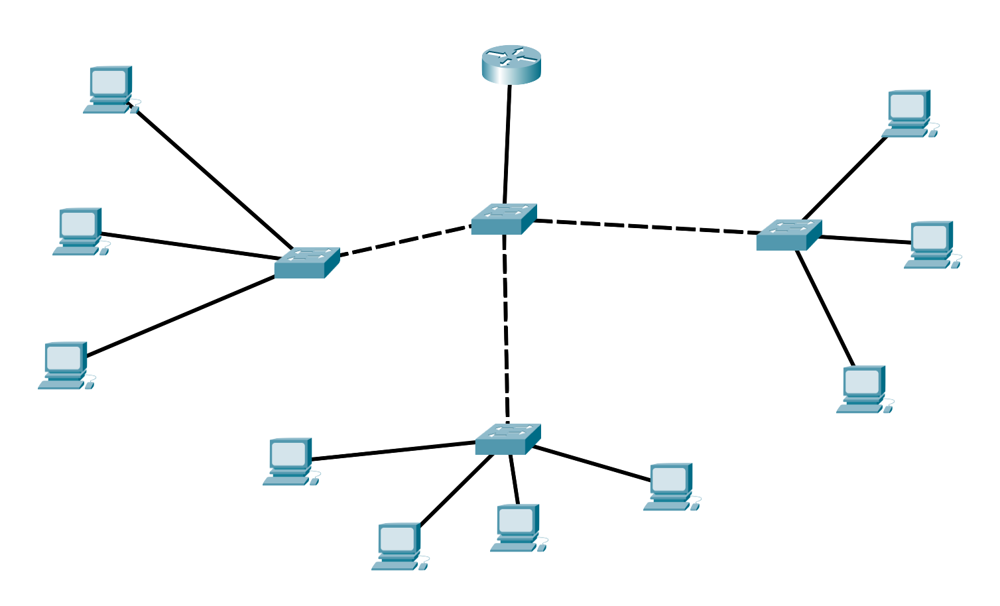

# Breve riepilogo sulle reti locali

Quando abbiamo fatto il subnetting, abbiamo considerato il caso di computer connessi all'interno di una _rete locale_, come ad esempio un'azienda, una scuola o un ospedale. In queste situazioni i dispositivi vengono disposti _a stella_, ovvero tanti computer connessi ad uno switch di primo livello, eventualmente tanti switch di primo livello connessi ad uno switch di secondo livello che poi finalmente arrivano ad un router per la connessione con il mondo esterno.

<figcaption class="centered">Rete locale, topologia a stella</figcaption>

Questa configurazione è utile nel caso in cui ci sia un numero limitato di computer, e un amministratore di rete che tenga sotto controllo la situazione.

Uno dei problemi principali di questa tipologia infatti è quello che viene definito il [_single point of failure_](https://it.wikipedia.org/wiki/Single_point_of_failure) (SPOF), che si può tradurre in italiano come "singolo punto di vulnerabilità": se uno qualsiasi degli switch o il router si rompe, tutta o una parte significativa della perde funzionalità.

Nel caso di rete molto grandi questo non è accettabile, vediamo come si risolve il problema.