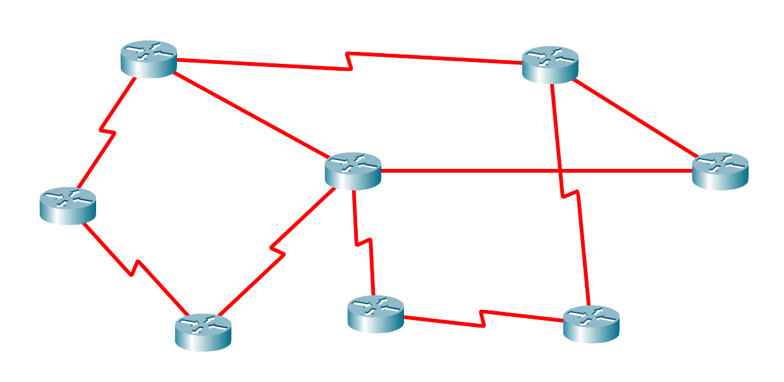
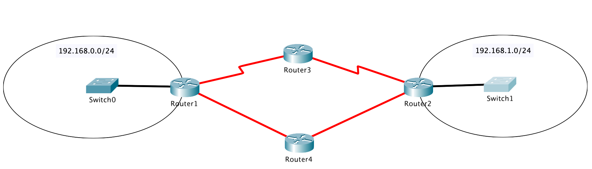

# Wide Area Networks

Quando dobbiamo mettere in comunicazione tante reti locali fra di loro, ci troviamo in una situazione definita _rete geografica_ o in inglese _wide area network_ (WAN).

In una WAN, i dispositivi che consideriamo non sono più PC o laptop, ma per la maggior parte sono router. Inoltre, non essendoci in generale una gerarchia precisa tra i vari router che formano la WAN, la topologia in questo caso è _a maglia_ (in inglese _mesh_), come mostrato nella figura qui sotto.

<figcaption class="centered">Rete geografica, topologia a maglia</figcaption>

Come si può vedere, anche il cavo per i collegamenti in una rete geografica sono diverso rispetto ai dispositivi in una rete locale: dovendo di solito percorrere lunghe distanze, non si usano cavi LAN ma cavi seriali (rossi a zig zag in figura) o in fibra ottica (rossi dritti).

Per mandare un pacchetto da un router (o nodo) della rete ad un altro possono esistere diversi percorsi che passano attraverso diversi router e cavi. Come si può facilmente intuire, in questo contesto diventa critico sapere qual'è il percorso migliore tra due router. Come sempre, ci sono varie possibili soluzioni a questo problema, come illustrato di seguito.

## Configurazione manuale delle tabelle di routing
Una possibile soluzione è configurare le tabelle di routing manualmente. Immaginiamo il seguente scenario.

In questo caso, potremmo ad esempio manualmente configurare `Router1` per instradare i pacchetti diretti alla rete `192.168.1.0/24` attraverso il `Router4` perché sappiamo che i collegamenti sono in fibra ottica e quindi più veloci rispetto a quelli seriali.

Come si può facilmente immaginare, però, al crescere delle dimensioni della rete può diventare impraticabile configurare tutti i router in modo manuale. Sono stati quindi ideati dei metodi alternativi in cui i router si configurano automaticamente dialogando tra loro.