# Protocolli ed algoritmi di routing

Per poter fare in modo che un pacchetto raggiunga la destinazione seguendo un percorso ottimale, abbiamo bisogno di due ingredienti:

- un algoritmo matematico che definisca e calcoli il percorso ottimale
- un protocollo informatico che permetta ai router di scambiarsi le informazioni in modo efficiente e sicuro

In questa pagina parleremo in particolare delle tecnologie relative al protocollo _Open Shortest Path First_ (_OSPF_), che utilizza:
- l'algoritmo di Dijkstra per il calcolo del percorso minimo
- link state e flooding per scambiarsi le informazioni

Vediamo queste cose più in dettaglio

## Algoritmo di Dijkstra

Per la spiegazione di seguito potete anche usare [questo grafo interattivo](http://graphonline.ru/en/?graph=qlBFcODimedbJpRq).

Questo algoritmo arriva alla distanza ottimale calcolando tutto l'albero dei cammini minimi tra un nodo e l'altro. I percorsi tra i nodi possono avere pesi differenti: il cammino minimo sarà quello la cui somma di tutti i percorsi ha il valore minore.

Ipotizziamo il seguente grafo. In questi grafi, nella realtà ad ogni nodo corrisponde un router.

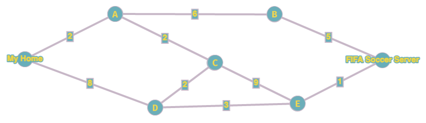

Vogliamo andare da casa mia fino al server di FIFA Soccer. Cominciamo quindi con il calcolare la distanza di tutti i nodi da casa mia. 

Per prima cosa, calcolo la distanza tra casa mia e casa mia: la distanza è ovviamente 0.

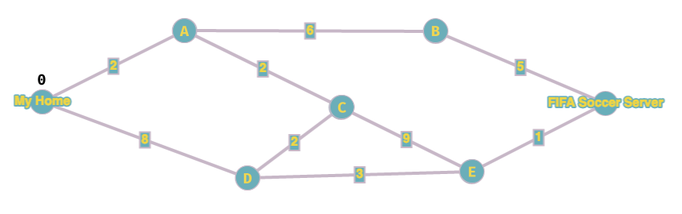

Adesso l'algoritmo richiede di:

1. scegliere il nodo libero con distanza minore e lo "blocco" (nel nostro disegno lo coloro di rosso e metto un riquadro intorno al valore)
2. calcolare il valore di tutti i nodi adiacenti ancora liberi

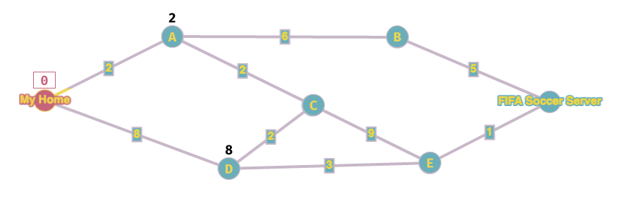

Adesso ripeto i passi 1 e 2 precedenti. Il nodo libero con valore più basso è `A`, lo blocco e assegno i valori ai nodi adiacenti. **Importante**: quando blocco un nodo, devo segnare con una freccetta il nodo da cui proviene il valore della distanza, in modo che alla fine posso facilmente ricostruire il percorso tra casa mia ed il server.

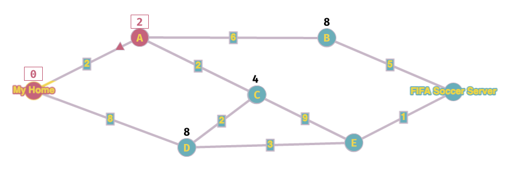

A questo punto ripeto le operazioni precedenti finché non finisco **tutti** i nodi. Adesso il nodo libero con valore più basso è `C`, lo blocco e calcolo il valore dei nodi adiacenti. **Attenzione**: il valore del nodo era già stato calcolato: visto che sto cercando il percorso con il costo minimo, lo sostituisco solo se quello nuovo è più basso. In questo caso il nuovo valore passando da `C` è 6, quindi è più basso, e quindi sbarro il valore precedente e lo sostituisco con questo nuovo.

> Se capita che il nuovo valore è uguale al precedente, potete scegliere se sostituire il valore nuovo o lasciare quello vecchio, in entrambi i casi si calcola il percorso minimo. In generale comunque, consiglio di lasciare il valore vecchio in modo da dover fare meno cancellazioni e modifiche!

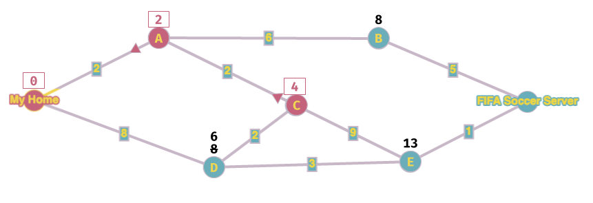

Ripeto l'iterazione, il nuovo nodo più basso è `D`, lo blocco e calcolo i nodi vicini.

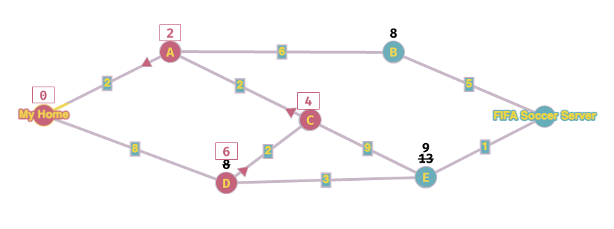

Ci siamo quasi...blocco `B` e vado avanti.

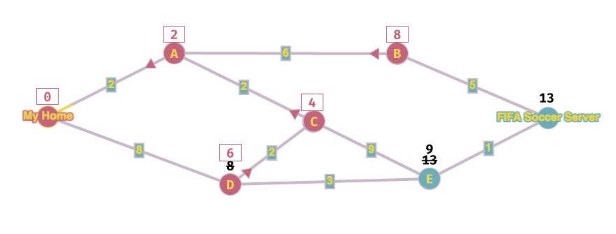

A questo punto avrei calcolato un valore del nodo di destinazione, ma _continuo comunque_ finché non blocco tutti i nodi.

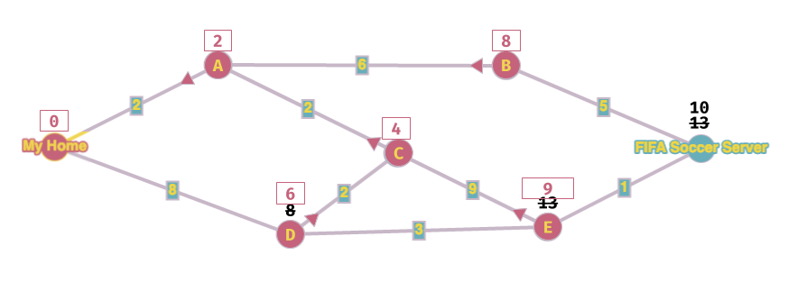

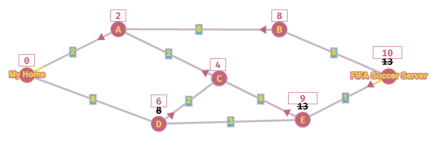

Bene, ho finito!! Ho calcolato che il costo per arrivare al server di FIFA è 10 ed il percorso è `FIFA->E->C->A->My Home`.

Notare che, una volta svolto l'algoritmo per un nodo, ho automaticamente il costo della distanza di _tutti_ i nodi. Notare inoltre che questa distanza è sempre quella _ottimale_, ovvero sono certo che la distanza e il percorso sono quelli a costo minore fra tutti quelli possibili.

Prima di concludere, copio in una la tabella il riepilogo di quanto calcolato finora.

| Nodo | Distanza da MyHome | Nodo precedente |
|:------:|:------------------:|:---------------:|
| MyHome | 0 |  |
| A | 2 | MyHome |
| B | 8 | A |
| C | 4 | B |
| D | 6 | C |
| E | 9 | C |
| Fifa | 10 | E |

Come si può vedere, ogni nodo ha sempre _uno ed un solo_ nodo di provenienza. Può capitare però, senza nessun problema, che un nodo possa avere _in ingresso_ più di una freccia. Significa semplicemente che quel nodo è un passaggio per più percorsi.

### Metodo alternativo
Se preferite, è possibile usare la tabella fin dall'inizio. In questo caso, dovete compilarla di pari passo con i passaggi dell'algoritmo, e aggiornarla man mano che procedete con le iterazioni. Vi consiglio di usare [questo](https://www.cs.usfca.edu/~galles/visualization/Dijkstra.html) sito per esercitarvi con questo metodo.

Entrambi i metodi sono validi e, ovviamente, portano allo stesso risultato. Provateli entrambi e decidete qual'è il migliore per voi.

> Al compito in classe potrete usare il metodo che preferite.

<!-- da aggiungere: cenni al Link State Protocol di OSPF -->

## Esercizi di preparazione al compito

Calcolare le tabelle dei costi dei seguenti grafi:

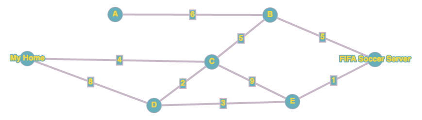

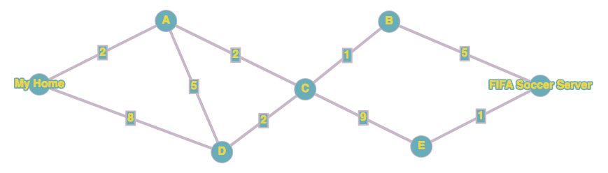

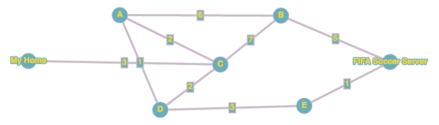

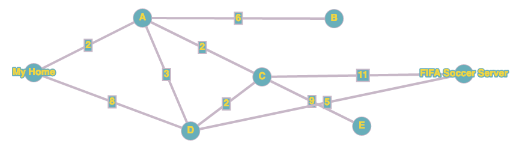

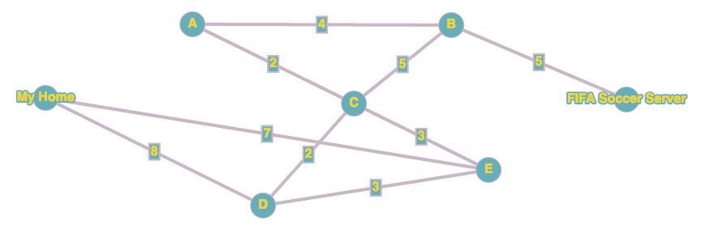

